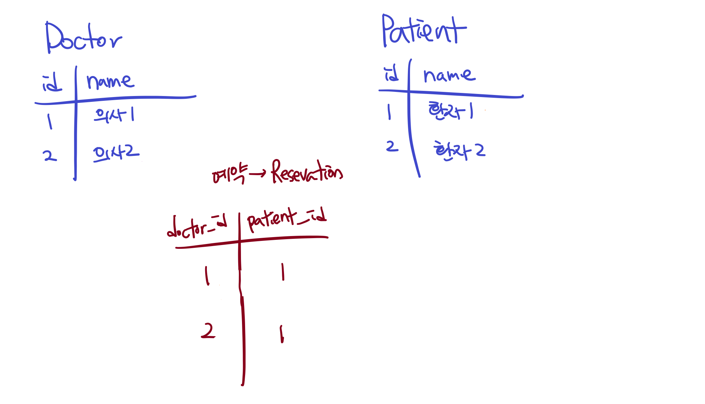
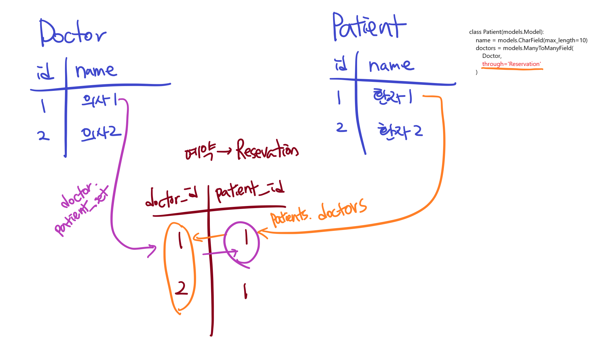

# Django model relationship

## 1:N (one to many)

### 준비

> `onetomany`  app 생성

```python
# models.py
class User(models.Model):
    username = models.CharField(max_length=10)
    
class Article(models.Model):
    title = models.CharField(max_length=100)
    content = models.TextField()
    user = models.ForeignKey(User, on_delete=models.CASCADE)

class Comment(models.Model):
    content = models.TextField()
    article = models.ForeignKey(Article, on_delete=models.CASCADE)
    user = models.ForeignKey(User, on_delete=models.CASCADE)
```


```python
from onetomany.models import User, Article, Comment

# objects
u1 = User.objects.create(username='Kim')
u2 = User.objects.create(username='Lee')

a1 = Article.objects.create(title='1글', user=u1)
a2 = Article.objects.create(title='2글', user=u2)
a3 = Article.objects.create(title='3글', user=u2)
a4 = Article.objects.create(title='4글', user=u2)

c1 = Comment.objects.create(content='1글1댓', article=a1, user=u2)
c2 = Comment.objects.create(content='1글2댓', article=a1, user=u2)
c3 = Comment.objects.create(content='2글1댓', article=a2, user=u1)
c4 = Comment.objects.create(content='4글1댓', article=a4, user=u1)
c5 = Comment.objects.create(content='3글1댓', article=a3, user=u2)
c6 = Comment.objects.create(content='3글2댓', article=a3, user=u1)
```

### 문제

1. 1번 유저가 작성한 글들

   ```python
   u1.article_set.all()
   ```

2. 2번 유저가 작성한 댓글의 내용을 모두 출력

   ```python
   for comment in u2.comment_set.all():
       print(comment.content)
   ```

3. 3번 글의 작성된 댓글의 내용을 모두 출력

   ```python
   for comment in a3.comment_set.all():
       print(comment.content)
   ```

   ```html
   
      {{ comment.content }}
   
   ```

4. 1글이라는 제목인 게시글들

   ```python
   Article.objects.filter(title='1글')
   ```

5. 글이라는 단어가 들어간 게시글들

   ```python
   Article.objects.filter(title__contains='글')
   ```

6. 댓글(N)들 중에 해당되는 글(1)의 제목이 1글인 것

   ```python
   Comment.objects.filter(article__title='1글')
   print(Comment.objects.filter(article__title='1글').query)
   ```

   * 1:N 관계에서 1의 열에 따라서,  필터링

     


## 2. M:N (Many to Many)

> M:N 관계 접근

### 1. 단순 직관적 모델링

> 위의 도식화된 내용을 그대로 models.py로 옮겨보자.

```python
class Doctor(models.Model):
    name = models.CharField(max_length=10)

class Patient(models.Model):
    name = models.CharField(max_length=10)

class Reservation(models.Model):
    doctor = models.ForeignKey(Doctor, on_delete=models.CASCADE)
    patient = models.ForeignKey(Patient, on_delete=models.CASCADE)
```

* 환자/의사 생성

    ```python
    d1 = Doctor.objects.create(name='dr.john')
    d2 = Doctor.objects.create(name='dr.kim')

    p1 = Patient.objects.create(name='구름')
    p2 = Patient.objects.create(name='근제')
    ```
    
* 예약 만들기

    ```python
    Reservation.objects.create(doctor=d1, patient=p1)
    Reservation.objects.create(doctor=d1, patient=p2)
    Reservation.objects.create(doctor=d2, patient=p1)
    ```

* 1번 의사의 예약 목록

    ```python
    d1.reservation_set.all()
    ```
    
* 1번 환자의 예약 목록

     ```python
    p1.reservation_set.all()
    ```

* 1번 의사의 환자 출력

    ```python
    for reservation in d1.reservation_set.all():
        print(reservation.patient.name)
    ```

### 2. 중개 모델 활용

> 의사 - 환자들 / 환자 - 의사들로 직접 접근하기 위해서는 `ManyToManyField`를 사용한다.
>
> `through`  옵션을 통해 중개 모델을 선언한다.
>
> ORM 조작을 용이하게 하자.!



```python
class Doctor(models.Model):
    name = models.CharField(max_length=10)

class Patient(models.Model):
    name = models.CharField(max_length=10)
    # M:N 필드! reservation 통해서, Doctor에 접근을 의미
    doctors = models.ManyToManyField(Doctor, 
                                    through='Reservation')

class Reservation(models.Model):
    doctor = models.ForeignKey(Doctor, on_delete=models.CASCADE)
    patient = models.ForeignKey(Patient, on_delete=models.CASCADE)
```

* 마이그레이션 파일을 만들거나, migrate를 할 필요가 없다.

  * 즉, 데이터베이스에 전혀 변경되는 것은 없고, ORM 조작에서의 차이만 존재한다.

* 의사, 환자 오브젝트 가져오기

  ```python
  p1 = Patient.objects.get(pk=1)
  d1 = Doctor.objects.get(pk=1)
  ```

* 1번 환자의 의사 목록

  > `ManyToManyField` 가 정의된 `Patient` 는 직접 참조

  ```python
  p1.doctors.all()
  ```

* 1번 의사의 환자 목록

  > `Doctor` 는 직접 참조가 아니라 `Patient` 모델의 역참조.
  >
  > 즉, 기본 naming convention에 따라 참조

  ```python
  d1.patient_set.all()                                                                   
  ```

  * `related_name` : 역참조 옵션
* 기본 값은 `{model 이름}_set` 
* 역참조 설정은 반드시 설정되어야 하는 상황이 있다.
  
  * django에서 makemigrations 하는 경우 직접 오류를 발생시켜준다.
    * 예) 작성자(User)-게시글(Article), 좋아요누른사람(User)-게시글(Article)
            * 위의 관계 설정시 모두 Article 클래스에 `related_name` 없이 정의를 하게 된다면, 역참조 이슈 발생
  
    ```python
    class Doctor(models.Model):
        name = models.TextField()
    
    class Patient(models.Model):
        name = models.TextField()
        # 역참조 설정: related_name
        doctors = models.ManyToManyField(Doctor, 
                            through='Reservation',
                            related_name='patients')
    
    class Reservation(models.Model):
            doctor = models.ForeignKey(Doctor, on_delete=models.CASCADE)
        patient = models.ForeignKey(Patient, on_delete=models.CASCADE)    
    ```

### 3. 중개 모델 없이 설정

> 일반적으로 추가 필드 구성이 필요 없이 id 값만 존재하는 경우는 아래와 같이 선언한다.

```python
class Doctor(models.Model):
    name = models.TextField()

class Patient(models.Model):
    name = models.TextField()
    doctors = models.ManyToManyField(Doctor, 
                        related_name='patients')
```

* 이 경우 `앱이름_patient_doctors` 로 테이블이 생성된다.

* 해당 테이블에 Create/Delete를 위해서는 (예약을 생성하거나 삭제하기 위해서는) 아래의 메소드를 활용한다.

  ```python
  d1.patients.add(p1)
  # 각각 조회 해보자.
  d1.patients.all()
  p1.doctors.all()
  ```

  ```python
  d1.patients.remove(p1)
  # 각각 조회 해보자.
  d1.patients.all()
  p1.doctors.all()
  ```


### 결론

* 중개모델이 필요 없는 경우
  * 특정 Class에 `ManyToManyField` 선언 (중개 테이블 자동선언)
* 중개 모델이 필요한 경우 (추가 정보가 필요한 경우)
  * 중개 모델을 정의 후 
  * 특정 Class에 `ManyToManyField` 에 `through` 옵션을 통해 조작


* 그리고, ManyToMany에서는 복수형의 표현으로 반드시 `related_name`을 선언하자.


