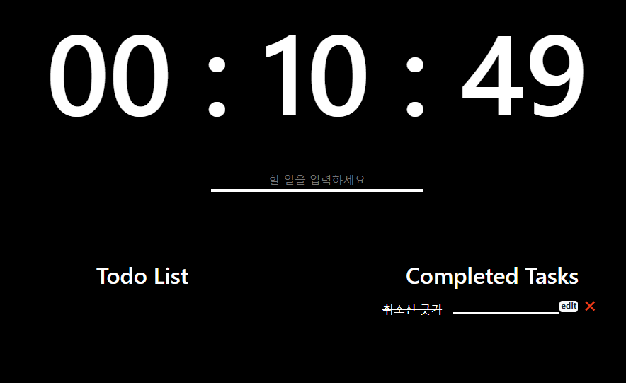

# Momentum clone coding_with vanilla javascript 2



## 기본 컨셉
    1. 할 일을 입력 후 enter를 친다. 
    2. toDo List에 업데이트된다. 
    3. 할일 마감 후 toDo의 글자부분을 클릭하면 Complete로 이동한다. 
    4. 이동된 toDo는 취소선이 그어지며, 클릭 시 다시 toDo List로 이동한다. 
    5. 수정 및 삭제는 ToDo List, Completed 어디에서도 가능하다. 


### 초기 변수 선언 및 할당 
```javascript
const form  = document.querySelector('form')
const input = form.querySelector('input')
const toDoList = document.querySelector("#toDoList")
const completeList = document.querySelector("#completeList")
```
> 할 일을 입력받기 위한 form, input을 변수에 담아주고 toDo가 실제로 보여질 ul태그 2개도 각각 id를 부여해 변수에 담아준다. 

### toDo 입력 받기

```javascript
function script(event) {
    event.preventDefault();
    const currentValue = input.value;
    if (currentValue !== "") {
        // append new toDo at toDoList
        paintTodo(currentValue);
    }
    input.value = null
}

function init() {
    // create new toDo
    form.addEventListener('submit',script);
}
init();
```
form에서 **사용자의 input이 입력받아지는 순간** 모든 일이 시작된다. 무슨 일들이 벌어지는지 살펴보자

우선 form 태그는 `enter` 키가 눌려지면 디폴트로 새로고침이 발생한다. 이를 방지하기 위해 우선 form에서 발생한 submit 이벤트의 디폴트 행동을 막아줄 필요가 있다. 이를 위해 `event.preventDefault()`를 사용해 `enter` 를 눌러도 새로고침이 발생하지 않게 막아준다. 

또한 아무 것도 입력하지 않았는데 `enter`를 눌렀다고 이벤트가 발생하는 일도 막아야 한다. 이는 사용자가 input 태그에 실제 입력한 값인 `input.value`가 null인지 아닌지를 통해 판별할 수 있다. 

모든 조건이 만족하면 ul 태그에 li로서 반영하는 일을 할 수 있다. 

### 사용자 입력값 ul 태그 아래 li에 반영하기
```javascript
function paintTodo(text) {
    // append new toDo at toDoList
    const li = document.createElement("li")
    li.className = "d-flex justify-content-center"
    const delBtn = document.createElement("button")
    delBtn.innerHTML = "\u{274C}";
    const span = document.createElement("span")
    span.innerText = text;
    const editForm = document.createElement("form")
    const editInput = document.createElement("input")
    editInput.className = "ml-3 edit"
    editForm.appendChild(editInput)
    editForm.addEventListener("submit",editTodos)
    const editBtn = document.createElement("span")
    editBtn.className = "badge badge-light edit-btn"
    editBtn.innerText = "edit"
    li.append(span,editForm,editBtn,delBtn);
    toDoList.appendChild(li);
    // edit toDo 이벤트 추가
    // cancelLine 이벤트 추가
    // delete toDo 이벤트 추가
}
```
1. `document.createElement()`를 통해 li태그, span태그 수정을 위한 form, 삭제버튼을 만들어준다.
2. 만들고 나서 클래스명, 내부 텍스트는 생성된 객체의 매서드(`innerText`, `innerHTML`, `className`)를 활용해 만들어줄 수 있다.
3. 이후 `li.append(span,editForm,editBtn,delBtn)`를 통해 span, form, button 모두를 li태그의 자식 노드로 합쳐준다. 
4. 합친 li태그는 toDoList ul 태그의 자식으로 합쳐준다. 

### toDo 수정 및 삭제하기
```javascript
function paintTodo(text) {
        ...
        ...
    // edit toDo
    editBtn.addEventListener("click", editTodos)
    editBtn.addEventListener("submit", editTodos)
}
```
수정 폼에 수정하려고 하는 내용을 입력하고 버튼 클릭 혹은 enter키를 눌렀을 때 수정 내용이 반영되게 하는 이벤트를 추가해주려고 한다. 

#### editTodos
```javascript
function editTodos(event) {
    if (event.type==="submit") {
        event.preventDefault();
    }
    const edit = event.target;
    const li = edit.parentNode;
    const preValue = li.querySelector("span")
    const editInput = li.querySelector("input")
    if (editInput.value) {
        preValue.innerText = editInput.value
        editInput.value = null
    }
}
```
1. 수정 폼의 내용이 제대로 반영되기 위해서는 다음 조건을 충족해야 한다. 
> 엔터키를 눌렀을때 새로고침이 발생하지 않아야 한다. 
  
    - 이를 위해 submit 타입(엔터키 클릭)으로 이벤트가 발생했을 경우 디폴트 이벤트를 막아주어야 한다. 
2. 'click' / 'submit' 이벤트가 발생한 원점 `event.target`을 바탕으로 **부모 노드를 찾아내고(`parentNode`) 자식 노드의 `querySelect()`를 추출**한다. 
3. 빈 input을 반영하는 일을 막기 위해 `editInput.value`를 확인한다. 
    - 내용이 있으면 앞에서 뽑아낸 수정 전의 `preValue`의 실제 텍스트를 `editInput.value`로 바꿔준다. 

### cancelLine
완료한 toDo는 toDo의 span부분 클릭 시 Completed ul로 이동하고 취소선이 그어지는 ui를 구현하려 한다. 
```javascript
function paintTodo(text) {
        ...
        ...
    // make cancelLine at toDo span
    span.addEventListener("click", cancelLine)
}
```
```javascript
function cancelLine(event) {
    const cancel = event.target;
    const li = cancel.parentNode;
    if (cancel.classList.contains("cancel")) {
        toDoList.appendChild(li)
        cancel.classList.remove("cancel")
    } else {
        completeList.appendChild(li)
        cancel.classList.add("cancel")
    }
}
```
1. 수정 로직과 마찬가지로 **이벤트가 발생하는 원점을 찾고 이를 바탕으로 부모노드를 찾아** 변수에 할당한다. 
2. 이벤트 원점에 해당하는 span태그의 클래스가 `cancel`이면(Completed ul의 자식이라면) `cancel`클래스를 삭제하고 toDoList의 자식으로 합쳐준다. 반대의 경우는 반대로 적용한다. 
```css
.cancel {
  text-decoration: line-through;
}
```

### deleteTodo
```javascript
function paintTodo(text) {
        ...
        ...
    // delete toDo 이벤트 추가
    delBtn.addEventListener("click", deleteTodos)
}
```

```javascript
function deleteTodos(event) {
    const btn = event.target;
    const li = btn.parentNode;
    const span = li.querySelector("span")
    if (span.classList.contains("cancel")) {
        completeList.removeChild(li);
    } else {
        toDoList.removeChild(li);
    }
}
```
삭제는 삭제버튼을 클릭 시에 작동하는 이벤트이다. 따라서 마찬가지로 **이벤트 원점과 부모노드**를 찾아준다. 삭제는 toDo에 있건 Completed에 있건 상관없이 이뤄저야 하기 때문에 다음과 같이 조건을 분기한다. 
1. span이 cancel 클래스를 가진 경우(completeList의 자식인 경우)
    - completeList에 있는 li 자식노드를 전부 삭제
2. 반대의 경우는 반대로 적용한다. 

사실 localstorage 안에 toDo를 저장하면 새로고침을 하더라도 사용자가 직접 삭제하기 전까지는 계속해서 뷰에 남아있는데 거기까지 구현은 못했다. 이는 향후 구현하기로 한다. 